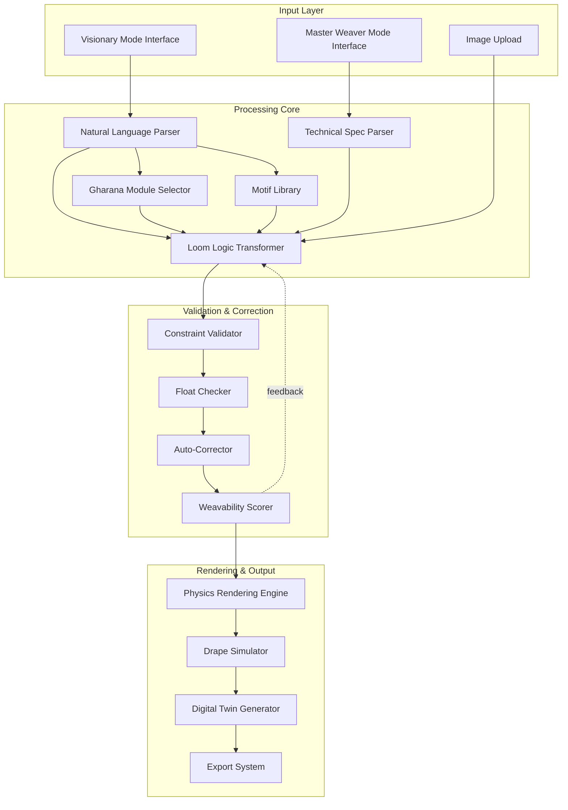

# Design Document: TantuAI - The Generative Loom Interface

## Overview

TantuAI is a dual-interface generative AI system that bridges the gap between creative textile design and traditional handloom manufacturing. The system consists of several interconnected components:

1. **Dual-Mode Interface Layer**: Provides both natural language (Visionary Mode) and technical specification (Master Weaver Mode) interfaces
2. **Loom Logic Transformer**: AI model trained on point paper designs that understands grid-based weaving constraints
3. **Constraint Validation Engine**: Physics-based validator that detects unweavable patterns and automatically corrects structural issues
4. **Gharana Modules**: Region-specific weaving style processors for authentic Indian textile traditions
5. **Motif Library**: Digital repository of traditional patterns with provenance tracking
6. **Physics-Based Rendering Engine**: Photorealistic fabric simulator with material-specific light properties
7. **Pattern Export System**: Multi-format exporter for industry-standard weaving tools

The system architecture follows a pipeline model: Input → Parsing → Generation → Validation → Correction → Rendering → Export

## Architecture

### System Architecture Diagram



### Component Interaction Flow

1. **Input Phase**: User provides input through either Visionary Mode (natural language) or Master Weaver Mode (technical specs)
2. **Parsing Phase**: Input is parsed into structured parameters (JSON format)
3. **Generation Phase**: Loom Logic Transformer generates grid-based pattern with Gharana Module constraints
4. **Validation Phase**: Constraint Validator checks for unweavable patterns (float length, shuttle capacity, structural integrity)
5. **Correction Phase**: Auto-Corrector inserts binding points and adjusts pattern to meet constraints
6. **Rendering Phase**: Physics-Based Rendering Engine creates photorealistic Digital Twin
7. **Export Phase**: Pattern exported in multiple formats (WIF, PDF, CSV, Jacquard)

## Components and Interfaces

### 1. Dual-Mode Interface Layer

**Purpose**: Provide appropriate interfaces for different user expertise levels

**Visionary Mode Interface**:
```typescript
interface VisionaryModeInput {
  prompt: string;                    // Natural language description
  referenceImages?: string[];        // Optional reference images
  stylePreferences?: {
    region?: string;                 // e.g., "Banarasi", "Kanchipuram"
    mood?: string;                   // e.g., "vintage", "modern"
    colorPalette?: string[];         // Color descriptions
    motifs?: string[];               // Named motifs
  };
}

interface VisionaryModeOutput {
  parsedParameters: DesignParameters;
  clarificationQuestions?: string[];
  suggestedMotifs?: MotifReference[];
}
```

**Master Weaver Mode Interface**:
```typescript
interface MasterWeaverModeInput {
  hookCount: number;                 // Jacquard hook count
  threadSpecs: {
    warp: ThreadSpecification;
    weft: ThreadSpecification;
  };
  density: {
    epi: number;                     // Ends per inch
    ppi: number;                     // Picks per inch
  };
  weaveStructure: WeaveStructureType;
  colorPalette: ThreadColor[];
  dimensions: {
    width: number;
    length: number;
  };
}

interface ThreadSpecification {
  fiberType: 'silk' | 'cotton' | 'art_silk' | 'wool' | 'synthetic';
  plyCount: number;
  denier: number;
  color: ThreadColor;
}
```

**Bidirectional Translation**:
```typescript
interface ParameterTranslator {
  naturalLanguageToTechnical(input: VisionaryModeInput): MasterWeaverModeInput;
  technicalToNaturalLanguage(input: MasterWeaverModeInput): string;
}
```

### 2. Natural Language Parser

**Purpose**: Convert aesthetic descriptions into structured design parameters

**Implementation Approach**:
- Use fine-tuned LLM with textile domain knowledge
- Maintain context database of Indian textile terminology
- Extract entities: colors, motifs, techniques, regions, moods

```typescript
interface NaturalLanguageParser {
  parse(prompt: string): ParsedDesignIntent;
  extractCulturalContext(prompt: string): CulturalContext;
  suggestClarifications(intent: ParsedDesignIntent): string[];
}

interface ParsedDesignIntent {
  motifs: string[];
  colors: ColorDescription[];
  technique: WeavingTechnique;
  region?: string;
  mood?: string;
  complexity: 'simple' | 'moderate' | 'complex';
}

interface CulturalContext {
  region: string;
  traditionalConstraints: TechniqueConstraints;
  typicalColorPalettes: ColorPalette[];
  authenticMotifs: string[];
}
```

### 3. Loom Logic Transformer

**Purpose**: Generate grid-based weaving patterns that respect loom physics

**Key Characteristics**:
- Trained on point paper designs (not photographs)
- Understands grid-based constraints
- Converts curves to step-patterns
- Applies anti-aliasing for visual smoothness

```typescript
interface LoomLogicTransformer {
  generatePattern(params: DesignParameters): WeavingPattern;
  convertCurvesToSteps(curve: CurveData): GridPattern;
  applyAntiAliasing(pattern: GridPattern): GridPattern;
  quantizeColors(image: ImageData, palette: ColorPalette): GridPattern;
}

interface WeavingPattern {
  grid: GridCell[][];              // 2D array of grid cells
  warpThreads: Thread[];
  weftThreads: Thread[];
  dimensions: {
    warpCount: number;
    weftCount: number;
  };
  metadata: PatternMetadata;
}

interface GridCell {
  warpIndex: number;
  weftIndex: number;
  isInterlaced: boolean;           // true if warp over weft
  color: ThreadColor;
}
```

**Training Data Requirements**:
- Point paper designs from various Indian weaving traditions
- Annotated with technique, region, and structural properties
- Paired with natural language descriptions
- Includes both historical and contemporary patterns

### 4. Gharana Module System

**Purpose**: Apply region-specific weaving style constraints and characteristics

```typescript
interface GharanaModule {
  name: string;
  region: string;
  applyConstraints(pattern: WeavingPattern): WeavingPattern;
  validateAuthenticity(pattern: WeavingPattern): AuthenticityScore;
  suggestImprovements(pattern: WeavingPattern): Suggestion[];
}

class BanarasiModule implements GharanaModule {
  name = "Banarasi";
  region = "Varanasi";
  
  applyConstraints(pattern: WeavingPattern): WeavingPattern {
    // Enforce continuous supplementary weft (brocade)
    // Prioritize dense Zari coverage
    // Apply traditional Banarasi color combinations
    // Ensure heavy silk base structure
  }
}

class IkatModule implements GharanaModule {
  name = "Ikat";
  region = "Odisha/Gujarat";
  
  applyConstraints(pattern: WeavingPattern): WeavingPattern {
    // Simulate resist-dye blur effect
    // Align patterns to tying grid
    // Apply characteristic color bleeding
    // Ensure pattern works with pre-dyed threads
  }
}

class JamdaniModule implements GharanaModule {
  name = "Jamdani";
  region = "West Bengal";
  
  applyConstraints(pattern: WeavingPattern): WeavingPattern {
    // Identify supplementary weft areas
    // Ensure discontinuous weft (motifs float independently)
    // Apply fine muslin base structure
    // Validate motif placement for hand-weaving
  }
}
```

### 5. Motif Library

**Purpose**: Store, retrieve, and preserve traditional weaving motifs

```typescript
interface MotifLibrary {
  addMotif(motif: Motif): void;
  searchByName(name: string): Motif[];
  searchByRegion(region: string): Motif[];
  searchBySimilarity(image: ImageData): Motif[];
  getMotifHistory(motifId: string): MotifProvenance;
}

interface Motif {
  id: string;
  name: string;
  alternateNames: string[];
  region: string;
  technique: WeavingTechnique;
  visualRepresentation: ImageData;
  pointPaperDesign: GridPattern;
  culturalSignificance: string;
  provenance: MotifProvenance;
  metadata: {
    dateAdded: Date;
    contributor: string;
    tags: string[];
  };
}

interface MotifProvenance {
  origin: string;
  masterWeaver?: string;
  community?: string;
  approximateAge?: string;
  historicalContext?: string;
  sources: string[];
}
```

**Search Capabilities**:
- Text search by name, region, technique
- Visual similarity search using image embeddings
- Cultural context search (temple motifs, floral, geometric)
- Technique-specific search (suitable for Jamdani, Brocade, etc.)

### 6. Constraint Validator

**Purpose**: Detect unweavable patterns and structural issues

```typescript
interface ConstraintValidator {
  validatePattern(pattern: WeavingPattern): ValidationResult;
  checkFloatLengths(pattern: WeavingPattern): FloatViolation[];
  checkShuttleCapacity(pattern: WeavingPattern): ColorViolation[];
  checkStructuralIntegrity(pattern: WeavingPattern): StructuralIssue[];
  checkThreadTension(pattern: WeavingPattern): TensionIssue[];
  calculateWeavabilityScore(pattern: WeavingPattern): WeavabilityScore;
}

interface ValidationResult {
  isWeavable: boolean;
  violations: Violation[];
  warnings: Warning[];
  suggestions: Suggestion[];
  weavabilityScore: WeavabilityScore;
}

interface FloatViolation {
  location: GridCoordinate;
  floatLength: number;
  maxSafeFloat: number;
  threadType: ThreadSpecification;
  severity: 'critical' | 'warning';
}

interface WeavabilityScore {
  overall: number;                   // 0-100
  structural: number;
  complexity: number;
  manufacturability: number;
  difficulty: 'easy' | 'moderate' | 'difficult' | 'expert' | 'impossible';
}
```

**Float Length Database**:
```typescript
interface FloatLengthDatabase {
  getMaxSafeFloat(threadSpec: ThreadSpecification): number;
}

// Example safe float lengths (in thread count)
const SAFE_FLOAT_LENGTHS = {
  silk: {
    fine: 5,      // Fine silk (20/22 denier)
    medium: 7,    // Medium silk (40/44 denier)
    heavy: 9      // Heavy silk (60+ denier)
  },
  cotton: {
    fine: 4,
    medium: 6,
    heavy: 8
  },
  zari: {
    pure: 3,      // Pure gold/silver
    art: 5        // Art silk with metallic coating
  }
};
```

### 7. Auto-Corrector

**Purpose**: Automatically fix structural issues while preserving design intent

```typescript
interface AutoCorrector {
  correctPattern(pattern: WeavingPattern, violations: Violation[]): CorrectedPattern;
  insertBindingPoints(pattern: WeavingPattern, floats: FloatViolation[]): WeavingPattern;
  reduceColors(pattern: WeavingPattern, maxColors: number): WeavingPattern;
  optimizeStructure(pattern: WeavingPattern): WeavingPattern;
}

interface CorrectedPattern {
  pattern: WeavingPattern;
  corrections: Correction[];
  visualImpact: number;              // 0-100, how much design changed
}

interface Correction {
  type: 'binding_point' | 'color_reduction' | 'structure_adjustment';
  location: GridCoordinate;
  before: GridCell;
  after: GridCell;
  reason: string;
}
```

**Binding Point Insertion Strategy**:
1. Identify all floats exceeding safe length
2. Calculate optimal binding point positions (minimize visual impact)
3. Insert interlacement points at calculated positions
4. Verify new pattern maintains structural integrity
5. Re-validate to ensure no new violations introduced

### 8. Physics-Based Rendering Engine

**Purpose**: Generate photorealistic visualization of woven textile

```typescript
interface PhysicsRenderingEngine {
  render(pattern: WeavingPattern): RenderedFabric;
  simulateMaterialProperties(threadSpec: ThreadSpecification): MaterialProperties;
  calculateLightInteraction(material: MaterialProperties, light: LightSource): Color;
  generateTexture(pattern: WeavingPattern): TextureMap;
}

interface MaterialProperties {
  reflectionModel: 'specular' | 'diffuse' | 'anisotropic';
  roughness: number;
  metallic: number;
  threadThickness: number;
  threadUnevenness: number;          // Handloom characteristic
}

interface RenderedFabric {
  image: ImageData;
  normalMap: TextureMap;             // For 3D depth
  roughnessMap: TextureMap;
  metallicMap: TextureMap;
}
```

**Material-Specific Rendering**:

**Zari (Metallic Thread)**:
- Reflection Model: Specular
- High metallic value (0.8-1.0)
- Low roughness (0.1-0.3)
- Sharp highlights and reflections

**Silk Thread**:
- Reflection Model: Anisotropic
- Directional sheen based on thread orientation
- Medium roughness (0.3-0.5)
- Subtle color shifts with viewing angle

**Cotton Thread**:
- Reflection Model: Diffuse
- Low metallic value (0.0-0.1)
- High roughness (0.6-0.8)
- Matte appearance with soft shadows

### 9. Drape Simulator

**Purpose**: Show how fabric hangs, folds, and moves

```typescript
interface DrapeSimulator {
  simulate(pattern: WeavingPattern, pose: FabricPose): DrapeSimulation;
  calculateFabricProperties(pattern: WeavingPattern): FabricProperties;
  applyPhysics(fabric: FabricProperties, gravity: Vector3): DrapeResult;
}

interface FabricProperties {
  weight: number;                    // grams per square meter
  stiffness: number;
  drapeCoefficient: number;
  flexibility: number;
}

interface DrapeSimulation {
  mesh: Mesh3D;
  animation?: AnimationData;
  foldLines: Line3D[];
}
```

**Fabric Property Calculation**:
```
weight = (warpThreadWeight * warpCount + weftThreadWeight * weftCount) / area
stiffness = f(threadType, weaveStructure, density)
drapeCoefficient = weight / stiffness
```

### 10. Export System

**Purpose**: Export patterns in industry-standard formats

```typescript
interface ExportSystem {
  exportWIF(pattern: WeavingPattern): string;
  exportPDF(pattern: WeavingPattern, rendering: RenderedFabric): Buffer;
  exportCSV(pattern: WeavingPattern): string;
  exportJacquard(pattern: WeavingPattern): Buffer;
  exportMetadata(pattern: WeavingPattern): PatternMetadata;
}

interface PatternMetadata {
  originalDesign: {
    source: 'visionary_mode' | 'master_weaver_mode' | 'image_upload';
    prompt?: string;
    technicalSpecs?: MasterWeaverModeInput;
  };
  conversionParameters: {
    gharanaModule?: string;
    motifs?: string[];
    corrections?: Correction[];
  };
  validationResults: ValidationResult;
  timestamp: Date;
  version: string;
}
```

**WIF (Weaving Information File) Format**:
```
[WIF]
Version=1.1
Date=2024-01-15
Source=TantuAI

[CONTENTS]
COLOR PALETTE=yes
WEAVING=yes
WARP=yes
WEFT=yes
THREADING=yes
TIEUP=yes
TREADLING=yes

[COLOR PALETTE]
1=255,0,0
2=0,255,0
3=0,0,255

[WEAVING]
Shafts=8
Treadles=10
Rising Shed=yes

[WARP]
Threads=400
Color=1,1,2,2,3,3...

[THREADING]
1=1
2=2
3=3
...
```

## Data Models

### Core Data Structures

```typescript
// Grid-based pattern representation
type GridPattern = GridCell[][];

interface GridCell {
  warpIndex: number;
  weftIndex: number;
  isInterlaced: boolean;
  color: ThreadColor;
}

// Thread representation
interface Thread {
  id: string;
  specification: ThreadSpecification;
  color: ThreadColor;
  position: number;
}

interface ThreadColor {
  name: string;
  rgb: [number, number, number];
  pantone?: string;
  threadCode?: string;
}

// Weaving pattern with full metadata
interface WeavingPattern {
  id: string;
  grid: GridPattern;
  warpThreads: Thread[];
  weftThreads: Thread[];
  dimensions: PatternDimensions;
  metadata: PatternMetadata;
  validationResult?: ValidationResult;
  rendering?: RenderedFabric;
}

interface PatternDimensions {
  warpCount: number;
  weftCount: number;
  widthInches: number;
  lengthInches: number;
  epi: number;
  ppi: number;
}

// Design parameters (intermediate representation)
interface DesignParameters {
  motifs: MotifReference[];
  colorPalette: ThreadColor[];
  technique: WeavingTechnique;
  gharanaModule?: string;
  threadSpecs: {
    warp: ThreadSpecification;
    weft: ThreadSpecification;
  };
  density: {
    epi: number;
    ppi: number;
  };
  dimensions: {
    width: number;
    length: number;
  };
  constraints: DesignConstraints;
}

interface DesignConstraints {
  maxFloatLength?: number;
  maxColors?: number;
  shuttleCapacity?: number;
  hookCount?: number;
  complexity?: 'simple' | 'moderate' | 'complex';
}

// Weaving techniques
type WeavingTechnique = 
  | 'plain_weave'
  | 'twill'
  | 'satin'
  | 'brocade'
  | 'jamdani'
  | 'ikat'
  | 'jacquard';

// Coordinate system
interface GridCoordinate {
  warp: number;
  weft: number;
}

// 3D geometry for rendering
interface Mesh3D {
  vertices: Vector3[];
  faces: Face[];
  uvCoordinates: Vector2[];
  normals: Vector3[];
}

interface Vector3 {
  x: number;
  y: number;
  z: number;
}

interface Vector2 {
  u: number;
  v: number;
}

interface Face {
  vertexIndices: [number, number, number];
  uvIndices: [number, number, number];
  normalIndices: [number, number, number];
}
```

### Database Schema

**Motif Library Database**:
```sql
CREATE TABLE motifs (
  id UUID PRIMARY KEY,
  name VARCHAR(255) NOT NULL,
  region VARCHAR(100),
  technique VARCHAR(50),
  visual_representation BYTEA,
  point_paper_design JSONB,
  cultural_significance TEXT,
  date_added TIMESTAMP,
  contributor VARCHAR(255),
  tags TEXT[]
);

CREATE TABLE motif_provenance (
  motif_id UUID REFERENCES motifs(id),
  origin VARCHAR(255),
  master_weaver VARCHAR(255),
  community VARCHAR(255),
  approximate_age VARCHAR(100),
  historical_context TEXT,
  sources TEXT[]
);

CREATE INDEX idx_motifs_region ON motifs(region);
CREATE INDEX idx_motifs_technique ON motifs(technique);
CREATE INDEX idx_motifs_tags ON motifs USING GIN(tags);
```

**Pattern History Database**:
```sql
CREATE TABLE patterns (
  id UUID PRIMARY KEY,
  user_id UUID,
  pattern_data JSONB,
  metadata JSONB,
  created_at TIMESTAMP,
  updated_at TIMESTAMP
);

CREATE TABLE pattern_iterations (
  id UUID PRIMARY KEY,
  pattern_id UUID REFERENCES patterns(id),
  iteration_number INTEGER,
  pattern_data JSONB,
  corrections JSONB,
  timestamp TIMESTAMP
);
```

**Float Length Database**:
```sql
CREATE TABLE safe_float_lengths (
  fiber_type VARCHAR(50),
  ply_count INTEGER,
  denier_range VARCHAR(50),
  max_safe_float INTEGER,
  PRIMARY KEY (fiber_type, ply_count, denier_range)
);
```

## Correctness Properties

*A property is a characteristic or behavior that should hold true across all valid executions of a system—essentially, a formal statement about what the system should do. Properties serve as the bridge between human-readable specifications and machine-verifiable correctness guarantees.*


### Property 1: Mode Switching Preserves Pattern Data

*For any* pattern data, switching from Visionary Mode to Master Weaver Mode and back to Visionary Mode should preserve the underlying pattern data without loss.

**Validates: Requirements 1.4**

### Property 2: Bidirectional Translation Consistency

*For any* natural language description that is translated to technical parameters, translating those technical parameters back to natural language should produce a semantically equivalent description.

**Validates: Requirements 1.5**

### Property 3: Natural Language Prompt Acceptance

*For any* valid natural language prompt in Visionary Mode, the system should accept and parse it without rejection.

**Validates: Requirements 1.2, 2.1**

### Property 4: Technical Specification Acceptance

*For any* valid technical specification in Master Weaver Mode, the system should accept it and generate a corresponding pattern.

**Validates: Requirements 1.3, 3.2**

### Property 5: Cultural Context Extraction

*For any* natural language prompt containing references to Indian textile traditions (Kanchipuram, Banarasi, Patola, etc.), the system should correctly identify the tradition and apply appropriate style constraints.

**Validates: Requirements 2.2**

### Property 6: JSON Parameter Structure

*For any* natural language prompt, the system should produce a valid JSON parameter file containing all required fields: motif, style, warp_density, weft_density, colors, and technique.

**Validates: Requirements 2.4**

### Property 7: Hook Count Constrains Complexity

*For any* specified hook count, the generated pattern's complexity should not exceed the mechanical capabilities of a loom with that hook count.

**Validates: Requirements 3.3**

### Property 8: Thread Density Compatibility

*For any* combination of EPI, PPI, and thread specifications, the validation system should correctly determine whether they are compatible and manufacturable.

**Validates: Requirements 3.4**

### Property 9: Image Format Support

*For any* valid image file in PNG, JPEG, SVG, or TIFF format, the system should successfully accept and process it.

**Validates: Requirements 4.1**

### Property 10: Grid Conversion Produces Valid Output

*For any* input image, the Loom Logic Transformer should produce a grid pattern where thread density is between 20 and 200 threads per inch.

**Validates: Requirements 5.1, 5.6**

### Property 11: Curve to Step-Pattern Conversion

*For any* design containing curves, the Loom Logic Transformer should convert all curves into step-patterns that can be executed on a grid-based loom.

**Validates: Requirements 5.4**

### Property 12: Color Palette Mapping

*For any* design and color palette, all colors in the output pattern should be from the defined color palette (no colors outside the palette should appear).

**Validates: Requirements 6.2**

### Property 13: Color Count Constraint

*For any* pattern generated with a maximum color count constraint, the number of distinct colors in the output should not exceed the specified maximum.

**Validates: Requirements 6.5**

### Property 14: Gharana Module Constraint Application

*For any* Gharana module (Banarasi, Ikat, Jamdani, Kanchipuram), when selected, the generated pattern should exhibit the characteristic structural and aesthetic properties of that weaving tradition.

**Validates: Requirements 7.2, 7.3, 7.4, 7.5, 7.6**

### Property 15: Motif Library Round-Trip

*For any* motif stored in the Motif Library with a given name, retrieving that motif by name should return the exact same pattern data.

**Validates: Requirements 8.3**

### Property 16: Motif Dual Representation

*For any* motif in the Motif Library, it should have both a visual representation and a technical Point_Paper_Design representation.

**Validates: Requirements 8.6**

### Property 17: Float Length Detection and Correction

*For any* pattern containing floats that exceed the Maximum_Safe_Float for the thread type, the Constraint Validator should detect all such floats and the Auto-Corrector should insert binding points to bring all floats within safe limits.

**Validates: Requirements 9.4, 10.3, 10.4**

### Property 18: Shuttle Capacity Violation Detection

*For any* pattern where a single row requires more colors than the specified shuttle capacity, the system should flag this as an unweavable pattern.

**Validates: Requirements 9.5, 10.7**

### Property 19: Weavability Classification

*For any* pattern, the system should classify it as either "impossible to weave" (violates physics), "difficult to weave" (requires advanced skill), or "weavable" (manufacturable).

**Validates: Requirements 9.7**

### Property 20: Structural Validation Completeness

*For any* generated pattern, the Constraint Validator should check all structural aspects: weave structure stability, float lengths, thread density compatibility, and thread tension balance.

**Validates: Requirements 10.1, 10.2, 10.6, 10.8**

### Property 21: Material-Specific Rendering Properties

*For any* pattern containing Zari threads, silk threads, or cotton threads, the rendering should apply the correct reflection model: specular for Zari, anisotropic for silk, and diffuse for cotton.

**Validates: Requirements 11.2, 11.3, 11.4**

### Property 22: Draft Pattern Completeness

*For any* finalized weaving pattern, the generated draft should include all required components: threading sequence, tie-up, treadling sequence, reed count, and pick count.

**Validates: Requirements 12.1, 12.3**

### Property 23: Real-Time Preview Updates

*For any* pattern parameter modification, the preview should update within a reasonable time threshold (e.g., < 2 seconds for simple patterns, < 5 seconds for complex patterns).

**Validates: Requirements 13.3**

### Property 24: Constraint Violation Feedback

*For any* constraint violation detected by the Constraint Validator, the system should provide specific feedback describing the violation, its location, and its severity level.

**Validates: Requirements 14.1, 14.2, 14.3**

### Property 25: Pattern Iteration History

*For any* sequence of pattern modifications, the system should maintain a complete history allowing comparison between any two versions and reversion to any previous version.

**Validates: Requirements 14.5**

### Property 26: WIF Export Round-Trip

*For any* weaving pattern exported to WIF format, importing that WIF file should produce an equivalent pattern (preserving grid structure, threading, and colors).

**Validates: Requirements 15.1**

### Property 27: Export Metadata Completeness

*For any* exported pattern, the export should include complete metadata: original design source, conversion parameters, and validation results.

**Validates: Requirements 15.5**

### Property 28: Aspect Ratio Preservation During Optimization

*For any* pattern undergoing thread density optimization, the aspect ratio of the original design should be preserved in the optimized output.

**Validates: Requirements 16.4**

### Property 29: Multi-Layer Structural Connection

*For any* multi-layer weaving pattern, the Constraint Validator should verify that all layers are structurally connected and stable (no disconnected floating layers).

**Validates: Requirements 17.2**

### Property 30: Pattern Repeat Seamlessness

*For any* pattern with repeat parameters, the boundaries between repeated tiles should be seamless (no visible discontinuities or misalignments).

**Validates: Requirements 18.3**

### Property 31: Scaling Preserves Weave Structure

*For any* pattern that is scaled (warp or weft dimensions changed), the fundamental weave structure (plain, twill, satin, etc.) should be preserved.

**Validates: Requirements 18.4**

## Error Handling

### Error Categories

**1. Input Validation Errors**:
- Invalid image format
- Malformed technical specifications
- Out-of-range parameters (thread density, hook count)
- Incompatible thread specifications

**Error Response**:
```typescript
interface ValidationError {
  code: string;
  message: string;
  field?: string;
  suggestedFix?: string;
}
```

**2. Unweavable Pattern Errors**:
- Float length exceeds safe limits
- Shuttle capacity exceeded
- Structural instability
- Thread tension imbalance

**Error Response**:
```typescript
interface UnweavableError {
  code: string;
  message: string;
  locations: GridCoordinate[];
  severity: 'critical' | 'warning';
  autoCorrectAvailable: boolean;
  suggestions: string[];
}
```

**3. System Errors**:
- AI model inference failure
- Rendering engine failure
- Database connection failure
- Export format generation failure

**Error Response**:
```typescript
interface SystemError {
  code: string;
  message: string;
  timestamp: Date;
  requestId: string;
  retryable: boolean;
}
```

### Error Handling Strategy

**Graceful Degradation**:
- If physics-based rendering fails, fall back to simple grid visualization
- If auto-correction fails, provide manual correction suggestions
- If Gharana module fails, fall back to generic weaving constraints

**User Feedback**:
- All errors should provide clear, actionable messages
- Technical errors should be translated to user-friendly language
- Suggestions should be specific and implementable

**Logging and Monitoring**:
- All errors logged with full context (input parameters, system state)
- Critical errors trigger alerts
- Error patterns analyzed for system improvement

### Recovery Mechanisms

**Auto-Correction**:
```typescript
interface AutoCorrectionStrategy {
  detectIssue(pattern: WeavingPattern): Issue[];
  proposeCorrection(issue: Issue): Correction;
  applyCorrection(pattern: WeavingPattern, correction: Correction): WeavingPattern;
  validateCorrection(corrected: WeavingPattern): boolean;
}
```

**User-Guided Correction**:
- Present issues with visual highlighting
- Offer multiple correction options
- Allow manual adjustment with real-time validation
- Maintain undo/redo history

**Fallback Options**:
- Simplify pattern complexity
- Reduce color count
- Adjust thread density
- Change weaving technique

## Testing Strategy

### Dual Testing Approach

TantuAI requires both unit testing and property-based testing for comprehensive coverage:

**Unit Tests**: Focus on specific examples, edge cases, and integration points
- Test specific Gharana modules with known traditional patterns
- Test edge cases like empty images, single-color patterns, maximum complexity patterns
- Test integration between components (parser → transformer → validator)
- Test specific error conditions and recovery mechanisms

**Property-Based Tests**: Verify universal properties across all inputs
- Generate random patterns and verify all correctness properties
- Generate random thread specifications and verify validation logic
- Generate random color palettes and verify color mapping
- Generate random natural language prompts and verify parsing

### Property-Based Testing Configuration

**Testing Library**: Use a property-based testing library appropriate for the implementation language:
- Python: Hypothesis
- TypeScript/JavaScript: fast-check
- Java: jqwik
- Rust: proptest

**Test Configuration**:
- Minimum 100 iterations per property test
- Each test tagged with feature name and property number
- Tag format: `Feature: ai-weaving-bridge, Property N: [property description]`

**Example Property Test Structure**:
```python
from hypothesis import given, strategies as st

@given(
    pattern=st.builds(generate_random_pattern),
    max_colors=st.integers(min_value=2, max_value=20)
)
def test_color_count_constraint(pattern, max_colors):
    """
    Feature: ai-weaving-bridge, Property 13: Color Count Constraint
    For any pattern generated with a maximum color count constraint,
    the number of distinct colors should not exceed the specified maximum.
    """
    result = pattern_converter.convert_with_color_limit(pattern, max_colors)
    distinct_colors = count_distinct_colors(result)
    assert distinct_colors <= max_colors
```

### Unit Test Coverage

**Critical Components**:
- Natural Language Parser: Test parsing of various prompt styles
- Loom Logic Transformer: Test grid conversion with known inputs
- Constraint Validator: Test detection of specific violations
- Auto-Corrector: Test correction of known issues
- Gharana Modules: Test application of region-specific constraints
- Export System: Test format compliance for WIF, PDF, CSV

**Edge Cases**:
- Empty or single-pixel images
- Monochrome patterns
- Patterns with maximum complexity
- Patterns with minimum thread density
- Patterns with maximum thread density
- Images with transparency
- Oversized images requiring scaling

**Integration Tests**:
- End-to-end flow: Natural language prompt → Final export
- Mode switching: Visionary → Master Weaver → Visionary
- Error recovery: Unweavable pattern → Auto-correction → Valid pattern
- Motif library: Upload → Store → Retrieve → Use in pattern

### Testing Priorities

**High Priority** (Must be tested before any release):
1. Float length detection and correction (safety-critical)
2. Shuttle capacity validation (manufacturability)
3. Structural integrity validation (product quality)
4. Export format correctness (interoperability)
5. Mode switching data preservation (data integrity)

**Medium Priority** (Should be tested for production):
1. Gharana module constraint application (cultural authenticity)
2. Material-specific rendering (visual quality)
3. Color palette mapping (design fidelity)
4. Pattern repeat seamlessness (aesthetic quality)

**Low Priority** (Nice to have):
1. Real-time preview performance (user experience)
2. Drape simulation accuracy (visualization quality)
3. Motif search relevance (discoverability)

### Performance Testing

**Benchmarks**:
- Pattern generation: < 5 seconds for simple patterns, < 30 seconds for complex
- Validation: < 2 seconds for any pattern
- Rendering: < 10 seconds for photorealistic output
- Export: < 3 seconds for any format

**Load Testing**:
- Concurrent users: Support 100+ simultaneous pattern generations
- Motif library: Support 10,000+ motifs with sub-second search
- Pattern history: Support 100+ iterations per pattern

**Scalability Testing**:
- Large patterns: Support up to 10,000 x 10,000 grid cells
- High thread density: Support up to 200 threads per inch
- Multi-layer: Support 4 independent layers
- Color complexity: Support up to 50 distinct colors

## Implementation Notes

### Technology Stack Recommendations

**Backend**:
- Python with FastAPI for API server
- PyTorch or TensorFlow for Loom Logic Transformer
- PostgreSQL for Motif Library and pattern storage
- Redis for caching and session management

**Frontend**:
- React or Vue.js for dual-mode interface
- Three.js for 3D visualization and drape simulation
- Canvas API for grid pattern rendering
- WebGL for physics-based rendering

**AI/ML**:
- Fine-tuned LLM (GPT-4, Claude, or Llama) for natural language parsing
- Custom CNN trained on point paper designs for pattern generation
- Image segmentation models for motif extraction
- Style transfer models for Gharana module effects

### Development Phases

**Phase 1: Core Infrastructure** (Months 1-3)
- Dual-mode interface implementation
- Basic grid conversion (without AI)
- Simple constraint validation
- WIF export

**Phase 2: AI Integration** (Months 4-6)
- Natural language parser integration
- Loom Logic Transformer training and deployment
- Gharana module implementation
- Motif library setup

**Phase 3: Validation & Correction** (Months 7-9)
- Float detection and auto-correction
- Comprehensive constraint validation
- Weavability scoring
- Error handling and recovery

**Phase 4: Rendering & Visualization** (Months 10-12)
- Physics-based rendering engine
- Material-specific properties
- Drape simulation
- 3D visualization

**Phase 5: Polish & Optimization** (Months 13-15)
- Performance optimization
- User experience refinement
- Comprehensive testing
- Documentation and training materials

### Data Requirements

**Training Data for Loom Logic Transformer**:
- 10,000+ point paper designs from various traditions
- Annotated with technique, region, thread specs
- Paired with natural language descriptions
- Historical and contemporary patterns

**Motif Library Initial Population**:
- 1,000+ traditional motifs digitized
- Provenance data for each motif
- Regional coverage: Banarasi, Kanchipuram, Ikat, Jamdani, Chanderi
- Cultural context and significance documented

**Float Length Database**:
- Safe float lengths for 20+ thread types
- Covering silk, cotton, wool, synthetic, zari
- Various denier ranges and ply counts
- Validated by master weavers

### Security Considerations

**Data Privacy**:
- User patterns stored with encryption
- Motif provenance data protected
- User authentication and authorization
- GDPR compliance for European users

**Intellectual Property**:
- Motif attribution and provenance tracking
- User pattern ownership clearly defined
- Traditional knowledge protection
- Community contribution recognition

**API Security**:
- Rate limiting to prevent abuse
- Input validation to prevent injection attacks
- Secure file upload handling
- API key authentication for external integrations

## Conclusion

TantuAI represents a comprehensive solution to bridge generative AI capabilities with traditional Indian handloom weaving constraints. The system's dual-mode interface serves both creative designers and technical weavers, while the physics-based validation ensures all generated patterns are manufacturable. The integration of Gharana modules and the Motif Library preserves and democratizes India's rich textile heritage, making traditional patterns accessible for contemporary reinterpretation.

The architecture prioritizes correctness through comprehensive validation, automatic error correction, and extensive testing. The property-based testing approach ensures that universal correctness properties hold across all possible inputs, while unit tests validate specific examples and edge cases.

By combining modern AI capabilities with deep domain knowledge of traditional weaving, TantuAI enables a new paradigm of textile design: one where creativity is unconstrained by technical knowledge, yet every design respects the physical realities of handloom manufacturing.
